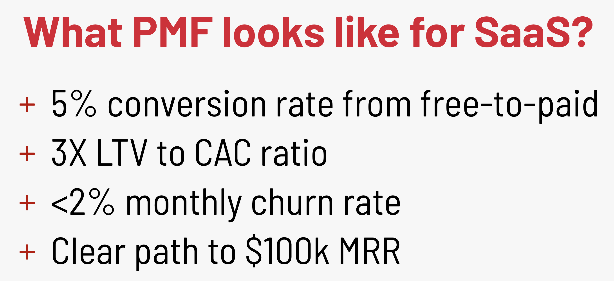
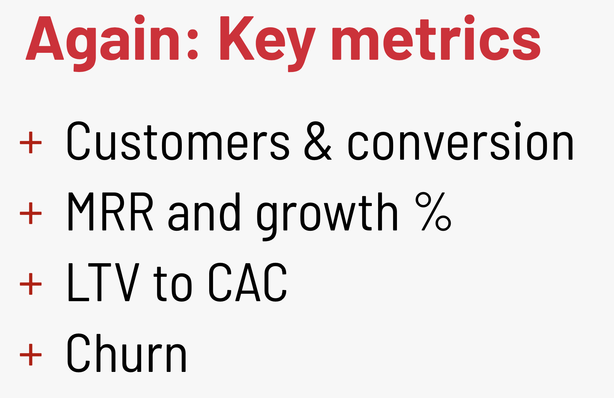

# Collection of structured materials

**Feel free to add materials and updates to current materials: [HERE](https://github.com/evios/evios.github.io/)**

[**Guide on markdown format**](https://guides.github.com/features/mastering-markdown/)

## Startups
[Assistant](https://ender.ai/startup_mentor/) that can help you find most relevant material based on your problem can be found in chatbot (in the bottom right corner)

* ### Ideas

* ### Getting Started

* ### Co-founders

* ### Growth

* ### Sales & Marketing
  * #### [Startups Sales:Acquisition](https://evios.github.io/startups/sales)

* ### PR

* ### Leadership

* ### People & Culture

* ### Product
  * #### [Product Market Fit Measuring] (https://medium.com/@zhenya.iosifov/product-market-fit-pmf-evaluation-bfc036ed71aa?sk=9483b3b7f0d0d505fde1ce8f4132b868)
  
  * #### [Jobs To Be Done framework for product management (JTBD)](https://medium.com/@zhenya.iosifov/jobs-to-be-done-framework-for-product-management-jtbd-395ab03aff8f)
  
* ### Fundraising
  * #### [Metrics](https://evios.github.io/startups/presentations/Presentation%20on%20Metrics.pdf)
  * #### 
  * #### 

* ### Fundraising Docs

* ### Legal & Finance

* ### Competition

* ### Enterprise

* ### Staying Alive

* ### Later Stage

* ### Investing
Evaluation frameworks:
Scorecard Valuation
Venture Capital method

* ### Non-profits

* ### Hardware

* ### Biotech

* ### Hard tech

* ### Artificial Intelligence

* ### Working at a Startup

### Tools
#TODO - move to Sales/Marketing subdir
Marketing - creation cool content
https://www.supa.ai/
https://crello.com/
